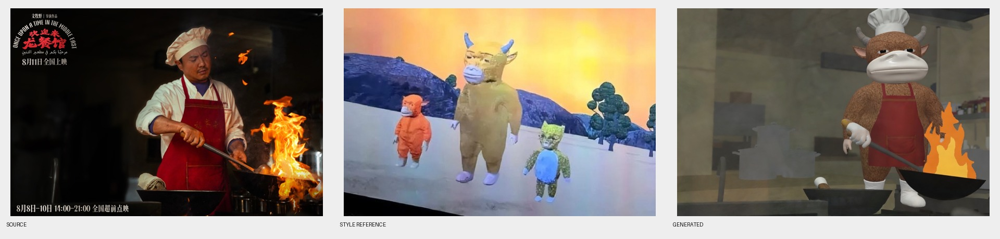

# 牛来风格图片生成

把实拍、剧照或新场景描述转成《牛来》正片那种粗粝、低成本 3D 画面。默认学习公开正片截帧，不学习水墨海报。

对照示例：



## 做什么

- 把真人照片或电影剧照重绘成直立拟人牛
- 保留人数、左右位置、动作、服装颜色和关键道具
- 按六维量表打分，低于门槛就继续改一处再生成

## 风格要点

- 香肠身体、几乎没腰
- 面具头、宽塑料嘴鼻、半闭小眼
- 短管四肢、连指手套、白袜蹄
- 拉伸重复的低精度毛贴图
- 教程式场景、平光、弱接触阴影

## 适合使用

- 「做成牛来风格」
- 「把这张剧照改成牛来」
- 「粗粝低模动物 3D」

## 不适合使用

- 不要用水墨海报当正片基准，除非用户明确要求海报风。
- 不要只换人头、保留实拍厨房或真实房间。

## 安装

```bash
npx skills add https://github.com/Pluviobyte/rnskill --skill rn-niulai-style-image
```
